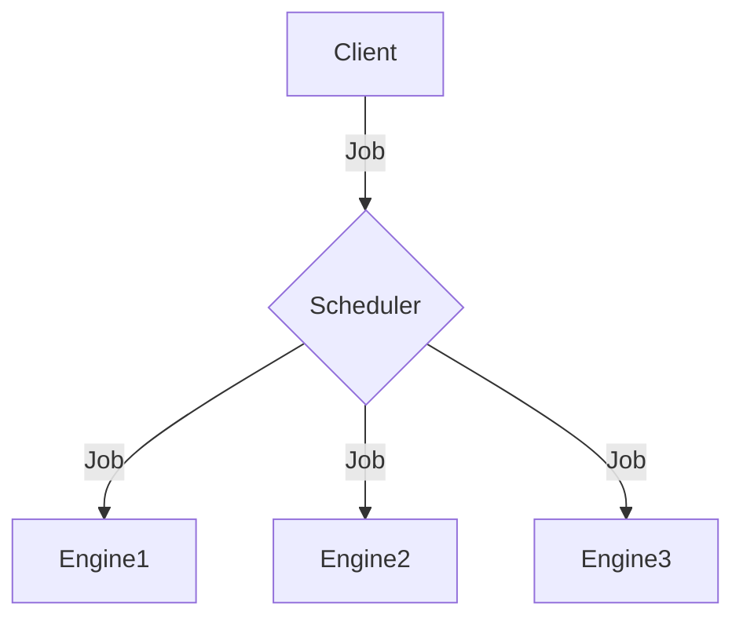
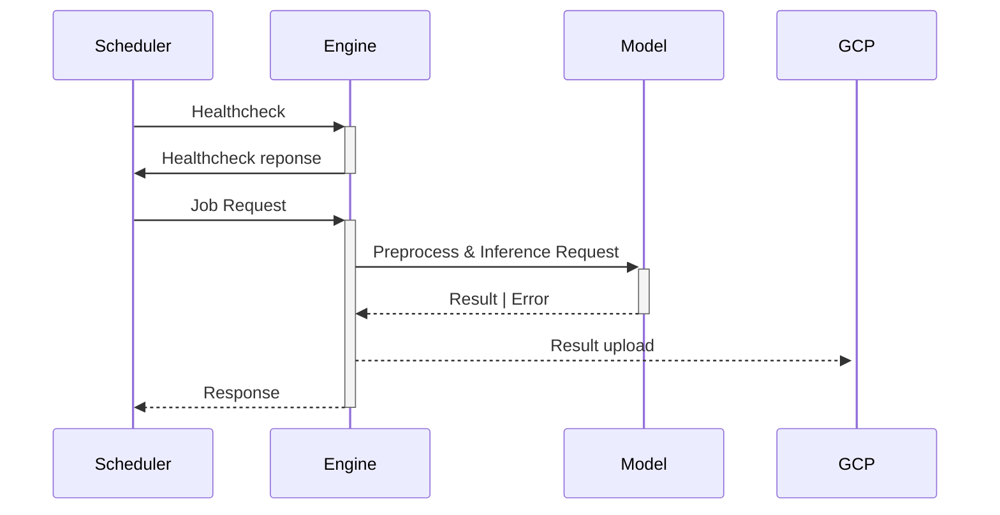
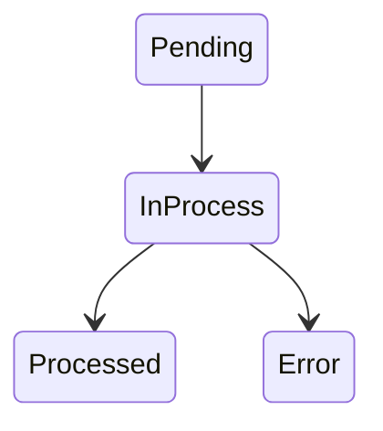
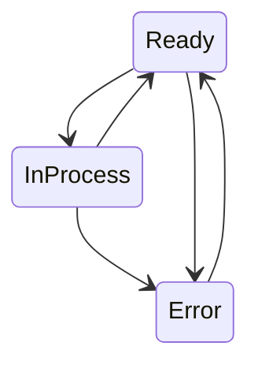

# ai-scheduling-server
Scheduling server for scheduling ai-profile generation jobs 

Restores and Synchronizes job scheduling state via `schedule_state.json` file. (which is created at initial run)

Supports job status retrieval & engine status(ai-server) configuration by REST-API at runtime.

## Architecture


## Job sequence

## State Transfer
### Job State

### EngineStatus State

## 1. Build&Run
```bash
# git clone prequisites
git clone https://github.com/aiprofile-gdsc-koreauniv/ai-scheduling-server/

cd ai-scheduling-server/

# create error log
touch $PWD/error.txt

# build docker image
docker build -t MY_CONTAINER_NAME .

# docker run
docker run -d \
   -p MY_PORT:9000 \
   -v $PWD:/app \
   MY_CONTAINER_NAME
```


## 참고사항
- docs-url : `http://localhost:MY_PORT/docs` 
- engine : [ai-api-server](https://github.com/aiprofile-gdsc-koreauniv/ai-api-server) 를 의미합니다.
- job : docs에 정의되어 있는 프로필 생성 요청 1건을 의미합니다.
- schedule_state.json : job의 state를 기록/복원하는 state 파일입니다.